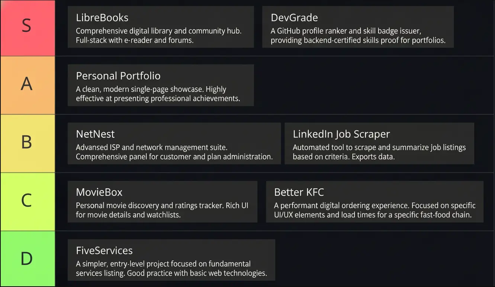

### Hi there ~ 

I'm **Himesh Dua**, a web developer from Karachi 🇵🇰 who turns ideas into fast, beautiful, and reliable web experiences.

I work mostly with **TypeScript** and **Next.js**, think of them as tools that help me build smooth, modern websites that not only _look good_ but also _work perfectly_ behind the scenes.

Recently, I've been building projects around:
- city-guide platforms
- developer tooling
- dashboards & admin systems
- AI-assisted workflows
- full-stack SaaS products

---

### 📊 Weekly Development Breakdown

<!--START_SECTION:waka-->
<!--END_SECTION:waka-->

---
### 🤝 Connect With Me

✉️ [`himeshdua22@gmail.com`](mailto:himeshdua22@gmail.com) • 🌐 [Portfolio](https://himeshdua.vercel.app) • 💼 [LinkedIn](https://www.linkedin.com/in/HimeshDua) • 📁 [GitHub](https://github.com/HimeshDua)
---

<!-- # Personal Projects Tier List

  -->

Peek into my coding life

 

